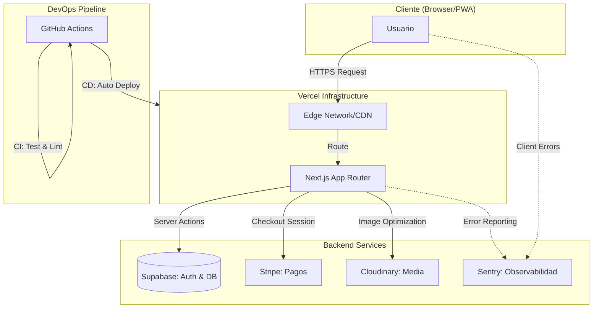

# StanStore 🎵 | E-commerce Seguro y Moderno


**StanStore** es una plataforma de comercio electrónico moderna enfocada en mercancía exclusiva. Este proyecto no solo es una tienda funcional, sino una **demostración de ingeniería de software segura**, implementando las mejores prácticas de ciberseguridad en el desarrollo web moderno.


*(Reemplaza esta imagen con una captura real de tu interfaz)*

## 🚀 Tecnologías (Tech Stack)

Este proyecto está construido sobre una arquitectura robusta, escalable y segura:

-   **Frontend**: [Next.js 15 (App Router)](https://nextjs.org/) - Renderizado híbrido (SSR/CSR) y Server Actions.
-   **Lenguaje**: [TypeScript](https://www.typescriptlang.org/) - Tipado estático estricto para reducir bugs en tiempo de ejecución.
-   **Base de Datos**: [Supabase](https://supabase.com/) (PostgreSQL) - Persistencia de datos relacional y autenticación.
-   **Pagos**: [Stripe](https://stripe.com/) - Procesamiento de pagos seguro y cumplimiento de PCI-DSS (vía delegación).
-   **Estilos**: [Styled Components](https://styled-components.com/) - CSS-in-JS con aislamiento de estilos y temas dinámicos.
-   **Animaciones**: [Framer Motion](https://www.framer.com/motion/) - Transiciones fluidas, gestos y efectos de micro-interacción.
-   **Validación**: [Zod](https://zod.dev/) - Validación de esquemas en tiempo de ejecución.
-   **Protección XSS**: Renderizado seguro por defecto en React y sanitización de inputs.
-   **Audit Logs (Nuevo)**: Sistema de registro inmutable que captura IP, User-Agent y detalles de acciones críticas (Login, Pagos, Admin) para análisis forense y compliance.

## 🏗️ Arquitectura del Sistema



---

## 🛡️ Ingeniería de Seguridad (Security Hardening)

Como proyecto enfocado en la ciberseguridad, se han implementado múltiples capas de defensa en profundidad según el top 10 de OWASP:

### 1. Validación de Entrada (Input Validation)
Todos los datos de entrada (formularios de login, registro, búsqueda) son **estrictamente validados y sanitizados** utilizando esquemas **Zod** antes de ser procesados.
-   *Prevención*: Inyección SQL (parcialmente cubierto por ORM), NoSQL Injection y datos malformados.
-   *Implementación*: `src/lib/validations.ts`.

### 2. Cabeceras de Seguridad HTTP (Security Headers)
Se ha configurado un **Middleware** personalizado para inyectar cabeceras de seguridad en todas las respuestas:
-   **Content-Security-Policy (CSP)**: Restringe las fuentes de ejecución de scripts (solo dominios confiables como Stripe/Supabase), mitigando ataques **XSS**.
-   **X-Frame-Options: DENY**: Previene ataques de **Clickjacking**.
-   **X-Content-Type-Options: nosniff**: Evita que el navegador "adivine" tipos MIME (MIME Sniffing).
-   **Referrer-Policy**: Protege la privacidad del usuario al navegar fuera del sitio.

### 3. Rate Limiting (Protección Anti-Brute Force)
Implementación de un algoritmo de **Token Bucket** (en memoria para demo) en el Middleware para proteger endpoints críticos (`/api/*`, Server Actions) contra ataques de fuerza bruta y denegación de servicio (DoS).
-   *Límite*: 20 peticiones por minuto por IP.

### 4. Autenticación y Autorización (IAM)
-   **Row Level Security (RLS)**: La seguridad se aplica a nivel del motor de base de datos (PostgreSQL). Incluso si una consulta SQL es inyectada, el atacante no puede ver datos que no le pertenecen.
-   **Server-Side Validation**: Las sesiones de pago de Stripe se crean exclusivamente en el servidor, validando los precios contra la base de datos para evitar la manipulación de precios en el cliente (Price Tampering).
-   **Gestión de Productos**: Formulario para crear nuevos productos directamente en Supabase.
-   **RLS Avanzado**: Políticas de seguridad que solo permiten `INSERT` si el usuario tiene `is_admin = true`.

### 🔍 Búsqueda Avanzada
-   **Debounce**: Input optimizado que evita peticiones innecesarias mientras el usuario escribe (`useDebounce` hook).
-   **Filtro Potente**: Búsqueda insensible a mayúsculas/minúsculas (`ilike`) en nombre, artista y categoría.
-   **UX**: Sugerencias automáticas cuando no hay resultados.


## 🌟 Funcionalidades Avanzadas (Nuevas)

### 1. Progressive Web App (PWA) 📱
StanStore es ahora instalable en dispositivos móviles y de escritorio.
- **Offline First**: Gracias a `@ducanh2912/next-pwa`, la aplicación cachea recursos críticos para funcionar sin conexión.
- **Install Prompt**: Un banner personalizado invita a los usuarios a instalar la app si su navegador lo soporta.
- **Manifiesto**: Iconos y configuración de tema personalizados.

### 2. Stock en Tiempo Real (Realtime) ⚡
Suscripción en vivo a la base de datos de Supabase.
- **Inventario Vivo**: Si alguien compra el último producto, el botón de "Añadir al Carrito" se deshabilita instantáneamente para todos los usuarios conectados sin recargar la página.
- **Badges Reactivos**: Avisos visuales cuando quedan pocas unidades (ej: "¡Solo quedan 2!").

### 3. Internacionalización (i18n) 🌍
Soporte global con enrutamiento localizado.
- **Idiomas**: Español (`/es`), Inglés (`/en`), Coreano (`/ko`).
- **Detección Automática**: Middleware que redirige según la preferencia del navegador.
- **SEO Internacional**: Etiquetas `hreflang` y metadatos localizados.

### 4. CI/CD Pipeline 🤖
Automatización robusta con GitHub Actions.
- **Validación Automática**: En cada `push` a `main`, se ejecutan:
    - Instalación limpia de dependencias.
    - **Linting**: Verificación de estilo y calidad de código.
    - **Tests Unitarios**: Ejecución de suite Vitest.
    - **Escaneo de Secretos**: Detección de API Keys expuestas con Gitleaks.
- **Despliegue Seguro**: Vercel solo despliega si todas las verificaciones pasan exitosamente.

## 📂 Estructura del Proyecto

---

## 📸 Galería

| Perfil de Usuario | Carrito de Compras | Pasarela de Pago |
|:---:|:---:|:---:|
|  |  |  |

---

## 🛠️ Instalación Local

Sigue estos pasos para desplegar el entorno de desarrollo:

1.  **Clonar el repositorio**:
    ```bash
    git clone https://github.com/tu-usuario/StanStore.git
    cd StanStore
    ```

2.  **Instalar dependencias**:
    ```bash
    npm install
    ```

3.  **Configurar Variables de Entorno**:
    Crea un archivo `.env.local` en la raíz y añade tus claves:
    ```bash
    NEXT_PUBLIC_SUPABASE_URL=tu_url
    NEXT_PUBLIC_SUPABASE_ANON_KEY=tu_clave
    NEXT_PUBLIC_STRIPE_PUBLISHABLE_KEY=pk_test_...
    STRIPE_SECRET_KEY=sk_test_...
    ```

4.  **Ejecutar servidor de desarrollo**:
    ```bash
    npm run dev
    ```

## 📄 Licencia

Este proyecto está bajo la Licencia MIT - siéntete libre de usarlo para aprendizaje.
